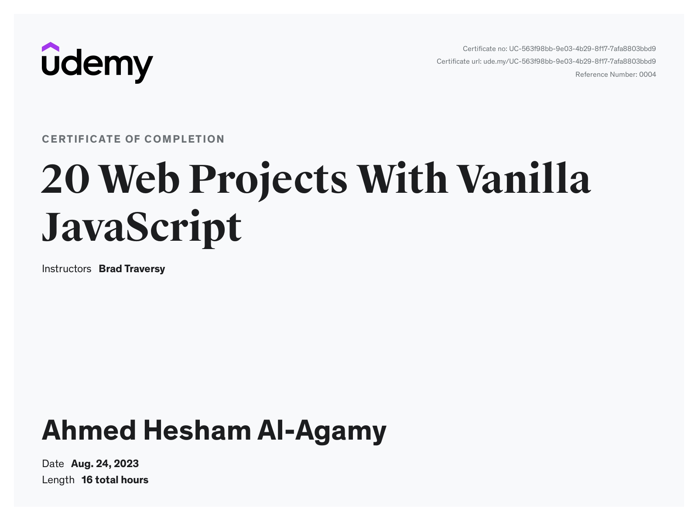

# 20+ Web Projects With Vanilla JavaScript Course - Content preview

<h1>
  This is 20+ Web Projects With Vanilla JavaScript :heart:
</h1>

Hi, My name is Ahmed Hesham and this is my apply what I learned in this course with the instructor

## Welcome! 👋

Thanks for checking out this 20+ Web Projects With Vanilla JavaScript content.

**To complete this challenge, I studied for a long time and it was a very interesting trip and I learned a lot from Brad and I wish for him a great success and special thanks to those in charge of the Al-Bunyan Al-Marsous competition, especially Engineer Ahmed Fathi, for their efforts, and I wish for them a great success.**

# 20+ Web Projects With Vanilla JavaScript

This is the main repository for all of the projects in the course.

- [Course Link](https://www.udemy.com/course/web-projects-with-vanilla-javascript/?referralCode=F9B7C7FED834F91ADE75)
- [Course Info Website](https://vanillawebprojects.com)

|  #  |            Project             | Live Demo |
| :-: | :----------------------------: | :-------: |
| 01  |       [Form Validator](https://github.com/Ahmed-Hesham123/Glassy-Form-Validator.git)       | [Live Demo](https://ahmed-hesham123.github.io/Glassy-Form-Validator/)  |
| 02  |     [Movie Seat Booking](https://github.com/Ahmed-Hesham123/Animated-Movie-Seat-Booking.git)    | [Live Demo](https://ahmed-hesham123.github.io/Animated-Movie-Seat-Booking/)  |
| 03  |    [Custom Video Player](https://github.com/Ahmed-Hesham123/Animated-Custom-Video-Player.git)     | [Live Demo](https://ahmed-hesham123.github.io/Animated-Custom-Video-Player/)  |
| 04  |  [Exchange Rate Calculator](https://github.com/Ahmed-Hesham123/Animated-Exchange-Rate-Calculator.git)  | [Live Demo](https://ahmed-hesham123.github.io/Animated-Exchange-Rate-Calculator/)  |
| 05  | [DOM Array Methods Project](https://github.com/Ahmed-Hesham123/Animated-DOM-Array-Method.git)  | [Live Demo](https://ahmed-hesham123.github.io/Animated-DOM-Array-Method/)  |
| 06  |    [Menu Slider & Modal](https://github.com/Ahmed-Hesham123/My-Landing-Page.git)    | [Live Demo](https://ahmed-hesham123.github.io/My-Landing-Page/)  |
| 07  |        [Hangman Game](https://github.com/Ahmed-Hesham123/Hangman-Game.git)       | [Live Demo](https://ahmed-hesham123.github.io/Hangman-Game/)  |
| 08  |       [Mealfinder App](https://github.com/Ahmed-Hesham123/Meal-Finder.git)      | [Live Demo](https://ahmed-hesham123.github.io/Meal-Finder/)  |
| 09  |      [Expense Tracker](https://github.com/Ahmed-Hesham123/Expense-Tracker.git)       | [Live Demo](https://ahmed-hesham123.github.io/Expense-Tracker//)  |
| 10  |        [Quran Player](https://github.com/Ahmed-Hesham123/Quran-Player.git)       | [Live Demo](https://ahmed-hesham123.github.io/Quran-Player/)  |
| 11  |     [Infinite Scrolling](https://github.com/Ahmed-Hesham123/My-Blog.git)     | [Live Demo](https://ahmed-hesham123.github.io/My-Blog/)  |
| 12  |        [Typing Game](https://github.com/Ahmed-Hesham123/Speed-Typer-Typing-Gamin.git)     | [Live Demo](https://ahmed-hesham123.github.io/Speed-Typer-Typing-Gamin/)  |
| 13  |     [Speech Text Reader](https://github.com/Ahmed-Hesham123/Speech-Text-Reader.git)    | [Live Demo](https://ahmed-hesham123.github.io/Speech-Text-Reader/)  |
| 14  |        [Memory Cards](https://github.com/Ahmed-Hesham123/Memory-Cards.git)     | [Live Demo](https://ahmed-hesham123.github.io/Memory-Cards/)  |
| 15  |      [LyricsSearch App](https://github.com/bradtraversy/vanillawebprojects/tree/master/lyrics-search)     | [Live Demo](https://vanillawebprojects.com/projects/lyrics-search/)  |
| 16  |        [Relaxer App](https://github.com/Ahmed-Hesham123/Relaxer-App.git)       | [Live Demo](https://ahmed-hesham123.github.io/Relaxer-App/)  |
| 17  |       [Breakout Game](https://github.com/Ahmed-Hesham123/Breakout-Game.git)       | [Live Demo](https://ahmed-hesham123.github.io/Breakout-Game/)  |
| 18  |     [New Year Countdown](https://github.com/Ahmed-Hesham123/New-Year-Countdown.git)   | [Live Demo](https://ahmed-hesham123.github.io/New-Year-Countdown/)  |
| 19  |       [Sortable List](https://github.com/Ahmed-Hesham123/Sortable-List-.git)       | [Live Demo](https://ahmed-hesham123.github.io/Sortable-List-/)  |
| 20  | [Speak Number Guessing Game](https://github.com/Ahmed-Hesham123/Speak-Number-Guess.git) | [Live Demo](https://ahmed-hesham123.github.io/Speak-Number-Guess/)  |

